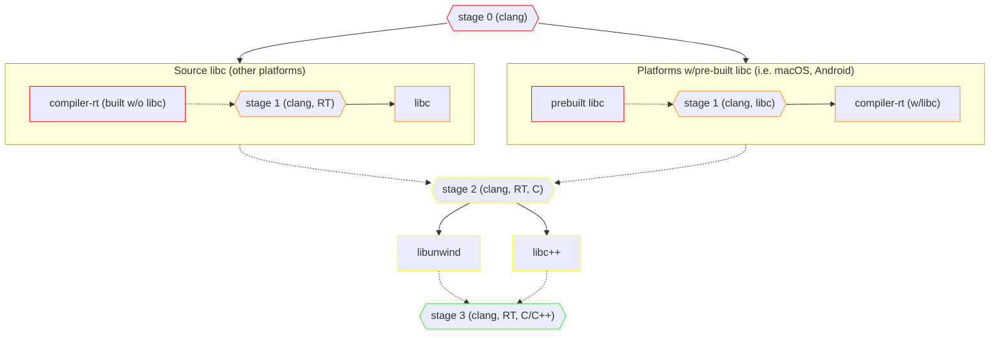
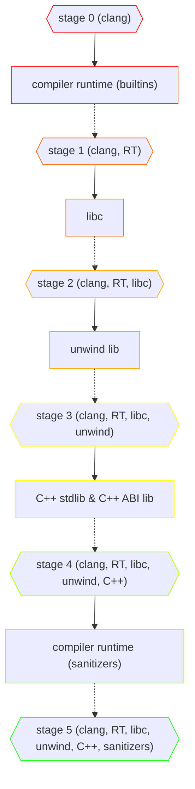

## overview

We want to model from-source builds[^why] for the following libraries in Bazel:
  - compiler builtins:
    + [ ] `compiler_rt`
    + later: `gcc_s`?
  - C standard library:
    + [ ] `glibc`
    + [ ] `musl`
    + later: llvm libc
    + later: mingw
    + later: libSystem for macOS
    + later: wasi-libc
    + later: uclibc?
  - C++ stdlib:
    + [ ] `libc++` + `libc++abi`
    + later: libstdc++
  - unwind library:
    + [ ] LLVM's `libunwind`
    + later: gcc's libunwind?

We have the following goals:
  - building these packages starting with just a bare `clang` binary (no prebuilt libc)
  - no host dependencies
    + this means we can't to model these packages with `rules_foreign_cc`
      * _technically_ we can provide toolchains with statically linked binaries for the necessary host deps (i.e. make, autoconf, etc.) but...
      * modeling this in Bazel confers other benefits and seems cleaner

There's lots of prior-art available to draw from, with varying degrees of applicability for our use case:
  - `zig`'s `zig cc` machinery
    + see [here](https://andrewkelley.me/post/zig-cc-powerful-drop-in-replacement-gcc-clang.html) and [here](https://github.com/ziglang/zig/tree/e54fcdb5b290f2a7b2dad73f23e35289ad2ebefe/lib) and [here](https://github.com/ziglang/zig/tree/e54fcdb5b290f2a7b2dad73f23e35289ad2ebefe/lib/libc)
    + `zig` comes closest to what we're trying to do here; it does from-source bootstrapping and models the build for these libraries in its own build system (i.e. doesn't invoke autoconf, make, etc.)
    + it also models libraries for non-Linux platforms (mingw, libSystem for macOS) — stuff we'd like to eventually tackle as well
  - `nixpkgs`, specifically the [`clang` bootstrapping set up](https://github.com/NixOS/nixpkgs/blob/0f8c6bed7ed892b92ca3ef6ad5344c8dd25ae262/pkgs/development/compilers/llvm/18/default.nix#L238-L405)
    + from-source bootstrapping and the same goals w.r.t. to reproducible and hermetic builds
    + but: uses the existing build system for these libraries (sensible choice, given its goals)
  - Linux distro packages for these libraries; i.e. [Arch](https://gitlab.archlinux.org/archlinux/packaging/packages)
  - `llvm` [Bazel overlay](https://github.com/llvm/llvm-project/tree/419d363385c7fa8bd969a817f95ab025ae94277c/utils/bazel)
    + has definitions for some LLVM subprojects
    + though... mostly tools and not the libraries
  - `rules_ll`'s [LLVM Bazel overlay](https://github.com/eomii/rules_ll/tree/3ee809512cfb605a00fe5eb938eab0e4f8705204/llvm-project-overlay)
    + this has Bazel definitions for the libraries in LLVM (`compiler-rt`, `libcxx`, etc.)

[^why]: We want this so that users can construct toolchains with arbitrary combinations of these libraries' versions.
    <!--  -->
    Accommodating this with prebuilts is not viable because of the [coupling between these libraries](#bootstrapping). For example, the C++ stdlib being used must be compiled against the `libc` that's used, both because of compile-time configuration (i.e. `libc++` has `ifdef`s for `musl`) and because of (for dynamic linking) symbol versioning (i.e. `.so`s produced for `libc++` will reference newer glibc symbols than are available at runtime if the compile-time glibc is newer than what's available at runtime).

## bootstrapping

> [!NOTE]
> For android and macOS [we actually build `compiler-rt` _with_ `libc`](https://github.com/NixOS/nixpkgs/blob/4c9c9a8004d7d6d82a2f5555766d772b84df7a7b/pkgs/development/compilers/llvm/18/default.nix#L382-L384) (I think this is because `libc` ships with the platform for these targets: `bionic` for android, `libSystem` for macOS)

TODO: this bootstrapping sequence is a little bit wrong?
  - see: https://www.collabora.com/news-and-blog/blog/2023/01/17/a-brave-new-world-building-glibc-with-llvm/
    + nixpkgs actually gets this wrong too, kind of...
      * for `useLLVM` platforms it breaks the `compiler-rt` libcxx/libc dependency by just... not building sanitizers
      * for other platforms (even when `clangUseLLVM` is used as the compiler), `compiler-rt` is compiled against glibc/libstdc++!
  - re: why does glibc link against libunwind: https://gist.github.com/MaskRay/3d05f5613a2f8e774aad26ee3da4e696

##### nixpkgs LLVM bootstrapping

##### our bootstrapping

plan for now?
  - (stage0) build compiler-rt (just builtins + crt components) from source
  - (stage1) libc:
    + musl: source build
    + glibc: use a pre-built
      * it'll be linked against the wrong:
        - builtins (`libgcc`, `crt*.o`, statically linked in?)
          + see [here for a patch that inhibits](https://gist.github.com/basedjakfan2/d8681950e2c0cb64ed88f90e153fe920)
        - libunwind?
      * codegen options (i.e. LTO, pic) won't align either but that's fine
        - `glibc` doesn't really build with `clang` (yet) anyways
      * it seems like glibc [actually only `dlopen`s `libgcc_s`](https://gist.github.com/MaskRay/3d05f5613a2f8e774aad26ee3da4e696); it's not actually linked against it...
        - unfortunately replacing ^ with [`llvm-libgcc`](https://reviews.llvm.org/D108416) is tricky... glibc [doesn't do a normal `dlopen` that respects rpaths](https://github.com/NixOS/nixpkgs/blob/da25f95bf4f0cbfdcb853f48e60229d6b30bb550/pkgs/development/libraries/glibc/default.nix#L77-L96); we'd have to place our `libgcc` shims at the FHS locations
        - fortunately the failure mode is acceptable: you just don't get unwinding in a couple of contexts
      * and `crtbegin`/`crtend` (supplied [by `compiler-rt`](https://reviews.llvm.org/D28791?id=84620) or `libgcc`) are only linked into _executables_ I think (it'd also be okay to mix and match these..)
      * compiler builtins provided by `libgcc.a` will be linked into the resulting libraries but I think that's okay
  - (stage2) build our libunwind?
  - (stage3) rebuild libc w/our libunwind?
    + note that these two steps are really only required for glibc... musl doesn't use a libunwind afaik
    + see above re: the consequences of not pointing glibc at our libunwind (i.e. very minimal)
    + gonna skip this step for now
  - (stage4) build libcxxabi, libcxx
  - (stage5) build compiler-rt's sanitizers
  - (stage6)

simplified (musl, glibc w/o compile-time unwind link?):
  - (stage0) compiler-rt, min
  - (stage1) libc (i.e. musl)
  - (stage2) libunwind
  - (stage3) libcxxabi, libcxx
  - (stage4) compiler-rt sanitizers
  + NOTE: on platforms with a pre-built libc do we get to skip the first two stages?
    * assumption is that `libc` provides `crtbegin`/`crtend`...
    * but: what about `clang_rt.builtins-<arch>.a`? I'd think these are still needed and aren't in `libc`...
    * gonna leave the bootstrapping chain as is; `stage1` -> `stage2` is just an effective no-op when the libc is pre-built

Going with the simplified flow for now at least... hopefully we can avoid the more complex flow (i.e. build libc another time), even for glibc.

## libs

### libc

[comparison](http://www.etalabs.net/compare_libcs.html) from Rich Felker

glibc:
  - zig only builds interface files; does not attempt to build glibc itself
    + assumption is that you'll use (at runtime) the glibc that's already on your machine
  - glibc is notoriously difficult to build
    + still does not build with clang.. (see [1](http://maskray.me/blog/2021-10-10-when-can-glibc-be-built-with-clang), [2](https://www.collabora.com/news-and-blog/blog/2021/09/30/a-tale-of-two-toolchains-and-glibc/), [3](https://www.collabora.com/news-and-blog/blog/2023/01/17/a-brave-new-world-building-glibc-with-llvm/))

musl:
  -

llvm-libc:
  -

wasi-libc:
  -

libSystem (macOS):
  -

### C++ stdlib

libstdc++:
  -
libc++:
  -

#### C++ stdlib ABI

libc++abi, libcxxrt (freebsd)

### unwind library

LLVM, GNU, ??

### compiler runtime

notes about `libgcc`, `libgcc_s`: encompasses both builtins and the unwind lib

## faq

how is this different from `zig cc` and [`hermetic_cc_toolchain`](https://github.com/uber/hermetic_cc_toolchain)?

why not just use [`hermetic_cc_toolchain`](https://github.com/uber/hermetic_cc_toolchain)?
  - modularity:
    + i.e. what if you want to use `libstdc++`? `uclibc`?
    + what if you want to bring your own custom fork of, say, `musl`?
  - control:
    + i.e. over flags, bootstrapping logic, etc. that are inside of `zig cc` instead of modeled in the build system
  - caching:
    + in the Bazel cache instead of in `zig`'s internal cache ([`/tmp/...`](https://github.com/uber/hermetic_cc_toolchain/issues/83), see [here](https://github.com/uber/hermetic_cc_toolchain/blob/2f3e04fa1394cdfdca36206b2e790fcfa1c36931/toolchain/defs.bzl#L148-L171))

<!-- honestly the answer is that for most use cases `hermetic_cc_toolchain` is probably a perfectly reasonable solution; part of the reason this repository exists is just to satisfy a personal curiosity: how practical is it to model from-source toolchain bootstrapping in Bazel? (i.e. without needing to invent your own build system à la zig and without shelling out to other build tools à la nixpkgs) -->

---

misc:
  - [`tuscan`](https://github.com/karkhaz/tuscan)
    + https://karkhaz.github.io/tuscan/
